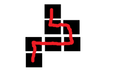
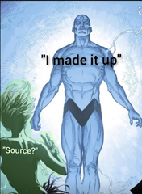
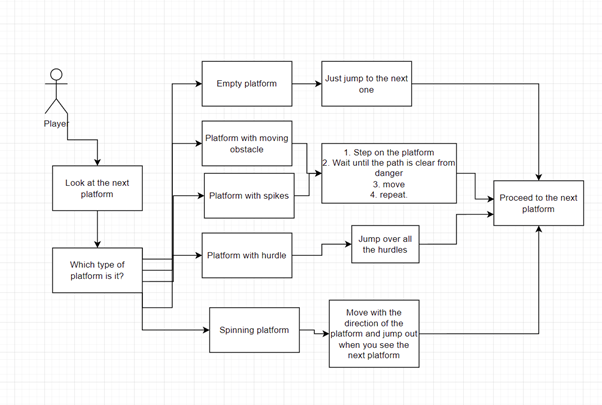

### The Name Of The Game: HW1

### Description:

A procedurally generated 3d platformer game with randomly generated dispersed platforms of with different obstacles

### Main Characters:

Fall guy

Story:

NaN

### The Gameplay:

**Goal**

Complete all the levels to get to the end of the game. To finish a level, step on the last platform in the chain

**Player skills**

Player needs to be familiar with basic movement (WASD) and jumping. Also some skill in navigating around the map is required, for example for the spikes section (its probably the most difficult) or the obstacle section.

**Game mechanics**

The player can walk around with standard controls and jump to get from one platform to another or to avoid jumping into the spikes

**Abilities and power-ups**

There are 2 types of power-ups: Pass through walls and Slow down all moving objects. These bonuses are randomly placed with a certain probability.

**Levels and challenges**

The levels are procedurally generated from these 5 templates:

1. an empty platform, 2. a platform with walls (hurdles) that the player needs to jump over. 3. a platform with moving obstacles that can knock the player off the platform. 4. a platform with spikes traps that appear and disappear with time. 5. a spinning platform which prevents the player from moving straight ahead

There are 6 leves. These levels increase in difficulty, the speed of the objects increases, the platform templates become more difficult and the size of the level increases.

**Losing**

The player can lose by moving into spikes or falling out of the world.

Graphics And Styling:

The game uses 3d graphics and a simple, flat design with a lot of grid patterns for the models

**How the levels are generated**

To generate a level the generator does N iterations of this algorithm:

1. First place a random type of platform at the current location.
2. Then choose a random location from three: up, left, right. (you cannot choose the direction opposite to your previous one.
3. Move to that direction

Also, it makes sure that these types of paths are not generated:

So that there is always just one way to jump to the next platform.

The value of N increases with the level progression.

**Ideas for Mechanics:**

**Links**

The grid material idea is from [https://www.youtube.com/watch?v=a94hDxzWMxI&amp;ab\_channel=SkorAU](https://www.youtube.com/watch?v=a94hDxzWMxI&amp;ab_channel=SkorAU)

The assets are from:

Fall guy model (although i modified it but ok) [https://sketchfab.com/3d-models/fall-guys-all-animations-dcecd97ca68b4f43b766a5258c1829a6#download](https://sketchfab.com/3d-models/fall-guys-all-animations-dcecd97ca68b4f43b766a5258c1829a6#download)

Spikes

[https://sketchfab.com/3d-models/spike-trap-01-4022678cac214fd2963894aa152fc6f2](https://sketchfab.com/3d-models/spike-trap-01-4022678cac214fd2963894aa152fc6f2)

Everything else i made on my own or took from basic ue4 assets

This is not miro but..

**Gameplay scheme**

